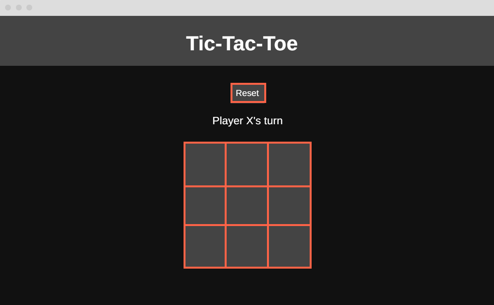

# Tic-Tac-Toe

This project is a simple front-end tic-tac-toe game that allows two players on the same computer to play against eachother.

## Technologies & Resources

* Version Control
    * Ubuntu Subsystem For Windows: Used Ubuntu based Linux subsystem for Windows to directly interact with files
    * Git: version control
    * GitHub: remote repository and project deployment
* Development
    * Google Chrome Browser: displaying game
    * Google Chrome Developer Tools: debugging and troubleshooting code
    * VS Code: used to create index, script, styles, and README
        * [markdownlint](https://marketplace.visualstudio.com/items?itemName=DavidAnson.vscode-markdownlint): VS Code extension used to assist with README formatting
* Design
    * [Google Fonts](https://fonts.google.com/):
        * Press Start 2P (h1)
        * Open Sans (body)
    * [Color Palette](https://www.color-hex.com/color-palette/97670): used color-hex.com for color scheme
    * [Wireframe](https://wireframe.cc): used wireframe.cc to design the UI

# Design Overview

## Wireframe

[Wireframe Link](https://wireframe.cc/AiUf3P)

## User Stories

* As a user, I should be able to start a new tic tac toe game
* As a user, I should be able to click on a square to add X first and then O, and so on
* As a user, I should be shown a message after each turn for if I win, lose, tie or who's turn it is next
* As a user, I should not be able to click the same square twice
* As a user, I should be shown a message when I win, lose or tie
* As a user, I should not be able to continue playing once I win, lose, or tie
* As a user, I should be able to play the game again without refreshing the page

# Demo Outline

* Shows current player's turn message
    * Valid clicks alternate between 'X' and 'O'
    * Can't click same square twice
* Solves for winner
    * Shown message on win
* Checks for tie
    * Shown message on tie
* Won't allow user to play or reset after game over (will auto reset 2.5 seconds)
* User can reset game if they like
    * Except if game is already over
        * Otherwise the auto reset could wipe new clicks

# Approach

## How I solved for the winner

* Used a 2D array containing win conditions to loop the grid boxes storing the contents in a temporary array
* Then I reduced the markers array into an array called matches to count instances of ‘X’, ‘O’, and empty string
* If matches ‘X’ or ‘O’ = the length of a win condition
    * Game is over
* If game still isn’t over
    * Check for tie

## Hurdles

* Wanted to optimize code more than I did even though time was not abundant
* Underestimated the time README would take to complete
* Struggled with breaking down my project in a way that other people can understand

# Takeaways

## What I would do differently

* Make a message text function so that gameText.innerText isn't as repetitive
* Add a separate function for tracking player turns instead of having that feature built into the main game loop

## What I learned

* Markdown formatting / README writing
* (Re)learned how to reduce arrays to count objects thanks to Usman's vote count example and MDN docs

## What would I do next

* Add sound effects for grid clicks, reset click, and game win or tie
* Add ability for players to choose their markers and substitute their choice for X and Y respectively
* Add a game theme so that it's less generic